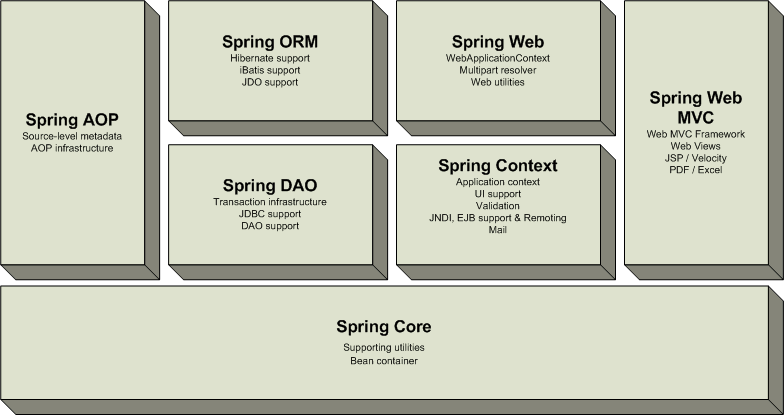

!SLIDE center

!SLIDE subsection
# modern enterprise app config

!SLIDE
# chris beams

!SLIDE
# you

!SLIDE small
# [github.com/cbeams/modern-config](http://github.com/cbeams/modern-config)

!SLIDE
# modern enterprise app config

!SLIDE bullets incremental
# _enterprise_
* think big
* (big enough to hire own devs)
* typically _not_ tech companies
* finance, media, insurance, gov't, ...

!SLIDE bullets incremental
# enterprise _application_
* typically long-lived
* teams change over time
* tech and requirements do too

!SLIDE bullets incremental
# enterprise _application_
* often large
* ... in size of codebase
* ... in no. of devs

!SLIDE bullets incremental
# enterprise _application_
* legacy and diversity are the rule

!SLIDE bullets incremental
# enterprise app _configuration_
* what components are involved?
* how are they parameterized?
* what dependencies exist?
* how are they satisfied?

!SLIDE bullets incremental
# _modern_ enterprise app config
* concise
* comprehensive
* clear and communicative
* flexible and extensible
* code-based and typesafe

!SLIDE center

!SLIDE bullets incremental
# the Spring mission
* to provide comprehensive infrastructural support for building enterprise applications

!SLIDE
# ok... but what exactly _is_ Spring?

!SLIDE center
# Spring Framework 1.x

!SLIDE center
# (2004)

!SLIDE
# 2004
# `spring ~= spring-framework`

!SLIDE center
# Spring Framework 3.x

!SLIDE center
# (2012)

!SLIDE
# 2012
# `spring != spring-framework`

!SLIDE transition=fade
# 2012
# `spring >> spring-framework`

!SLIDE bullets incremental
# `spring ==`
* `spring-framework`
* `spring-security`
* `spring-integration`
* `spring-batch`
* `spring-data-*`
* `spring-social`

!SLIDE bullets incremental
# `spring ==`
* `spring-roo`
* `spring-amqp`
* `spring-webflow`
* `spring-ws`
* `spring-net`
* `...`

!SLIDE
# `spring == spring-*`

!SLIDE center transition=scrollUp

!SLIDE bullets incremental
# `spring ==`
## comprehensive infrastructural support
* ...and there's a lot of infrastructure out there!
* _configuration_ is just one (important) concern

!SLIDE subsection
# which brings us back to...

!SLIDE
# modern enterprise app config

!SLIDE
# the approach
                                            ·

                                            ·

!SLIDE
# the approach
                         POJOs + 3rd party
                            components

                                            ·

!SLIDE
# the approach
                         POJOs + 3rd party
                            components

    configuration
    instructions

                                            ·

!SLIDE transition=fade
# the approach
                         POJOs + 3rd party
                            components
                                ↓
    configuration    ┌─────────────────────┐
    instructions   → │ the Spring container│
                     └─────────────────────┘

                                            ·

!SLIDE transition=fade
# the approach
                         POJOs + 3rd party
                            components
                                ↓
    configuration    ┌─────────────────────┐
    instructions   → │ (ApplicationContext)│
                     └─────────────────────┘

                                            ·

!SLIDE transition=fade
# the approach
                         POJOs + 3rd party
                            components
                                ↓
    configuration    ┌─────────────────────┐
    instructions   → │ the Spring container│
                     └─────────────────────┘

                                            ·

!SLIDE transition=fade
# the approach
                         POJOs + 3rd party
                            components
                                ↓
    configuration    ┌─────────────────────┐
    instructions   → │ the Spring container│
                     └─────────────────────┘
                                ⇊
                   ┌─────────────────────────┐
                   │ fully configured system │
                   │      ready for use      │
                   └─────────────────────────┘

!SLIDE transition=scrollLeft bullets incremental
# you get
* one consistent mechanism for config
* fail-fast behavior at startup
* dependency _injection_ vs dependency _lookup_
* ... leading to simple, testable POJO components
* ability to enhance behavior through AOP

!SLIDE transition=scrollRight
# config style
                         POJOs + 3rd party
                            components
                                ↓
    configuration    ┌─────────────────────┐
    instructions   → │ the Spring container│
                     └─────────────────────┘
                                ⇊
                   ┌─────────────────────────┐
                   │ fully configured system │
                   │      ready for use      │
                   └─────────────────────────┘

!SLIDE transition=fade
# config style
                         POJOs + 3rd party
                            components
                                ↓
      <beans>        ┌─────────────────────┐
        XML        → │ the Spring container│
                     └─────────────────────┘
                                ⇊
                   ┌─────────────────────────┐
                   │ fully configured system │
                   │      ready for use      │
                   └─────────────────────────┘

!SLIDE transition=scrollLeft
    @@@ xml
    <beans/>

!SLIDE
    @@@ xml
    <beans>

    </beans>

!SLIDE
    @@@ xml
    <beans>
        <bean id="foo" class="com.foo.Foo"/>
    </beans>

!SLIDE
    @@@ xml
    <beans>
        <bean id="foo" class="com.foo.Foo"/>

        <bean id="bar" class="com.foo.Bar">
           <property name="foo" ref="foo"/>
        </bean>
    </beans>

!SLIDE
    @@@ xml
    <beans>
        <bean id="foo" class="com.foo.Foo"/>

        <bean id="bar" class="com.foo.Bar">
           <property name="foo" ref="foo"/>
        </bean>

        <bean .../>
    </beans>

!SLIDE
    @@@ xml
    <beans>
        <bean id="foo" class="com.foo.Foo"/>

        <bean id="bar" class="com.foo.Bar">
           <property name="foo" ref="foo"/>
        </bean>

        <bean .../>

        <bean .../>
    </beans>

!SLIDE
    @@@ xml
    <beans>
        <bean id="foo" class="com.foo.Foo"/>

        <bean id="bar" class="com.foo.Bar">
           <property name="foo" ref="foo"/>
        </bean>

        <bean .../>

        <bean .../>

        <bean .../>

    </beans>

!SLIDE
    @@@ xml
    <beans>
        <bean id="foo" class="com.foo.Foo"/>

        <bean id="bar" class="com.foo.Bar">
           <property name="foo" ref="foo"/>
        </bean>

        <bean .../>

        <bean .../>

        <bean .../>

        <import resource="more-beans.xml"/>
    </beans>

!SLIDE incremental bullets
# `<beans>` xml
* simple
* general purpose
* flexible

!SLIDE smaller subsection
# but...

!SLIDE center incremental bullets
# `<beans>` xml
* verbose
* not typesafe
* wants special tooling

!SLIDE center incremental bullets
# `<namespace:*>` xml helps

!SLIDE center
# e.g.
    @@@ xml
    <tx:annotation-driven/>
    <aop:aspectj-autoproxy/>
    <jee:jndi-lookup/>
    <util:list/>

!SLIDE center incremental bullets
# `<namespace:*>` xml
* concise
* powerful
* easier to use

!SLIDE smaller subsection
# but...

!SLIDE center incremental bullets
# `<namespace:*>` xml
* opaque
* non-extensible
* difficult to <a href="http://static.springsource.org/spring/docs/2.0.x/reference/extensible-xml.html">write your own</a>

!SLIDE transition=scrollRight
# config style
                         POJOs + 3rd party
                            components
                                ↓
      <beans>        ┌─────────────────────┐
        XML        → │ the Spring container│
                     └─────────────────────┘
                                ⇊
                   ┌─────────────────────────┐
                   │ fully configured system │
                   │      ready for use      │
                   └─────────────────────────┘

!SLIDE transition=fade
# config style
                         POJOs + 3rd party
                            components
                                ↓
      <beans> +      ┌─────────────────────┐
     <namespace:*> → │ the Spring container│
        XML          └─────────────────────┘
                                ⇊
                   ┌─────────────────────────┐
                   │ fully configured system │
                   │      ready for use      │
                   └─────────────────────────┘

!SLIDE transition=fade
# config style
                         POJOs + 3rd party
                            components
                                ↓
     @Component-     ┌─────────────────────┐
       scanning    → │ the Spring container│
    + @Autowired     └─────────────────────┘
                                ⇊
                   ┌─────────────────────────┐
                   │ fully configured system │
                   │      ready for use      │
                   └─────────────────────────┘

!SLIDE transition=scrollLeft
    @@@java

    @Component
    public class Foo {
        // ...
    }

    @Component
    public class Bar {
        private Foo foo;

        @Autowired
        public void setFoo(Foo foo) {
            this.foo = foo;
        }
    }

!SLIDE incremental bullets
# `@Component`-scanning + `@Autowired`
* eliminates a lot of xml
* _really_ concise, convenient
* now widely used
* especially for MVC `@Controllers`

!SLIDE smaller subsection
# but...

!SLIDE incremental bullets
# `@Component`-scanning + `@Autowired`
* can&apos;t wire up third-party code
* ambiguities can arise (enter `@Qualifier`)
* still requires xml to bootstrap

!SLIDE smaller incremental bullets
# I mean, if you&apos;ve got this
    @@@ java
    package com.foo;

    @Component
    public class Bar {
        @Autowired
        public void setFoo(Foo foo) { ... }
    }
   
   
   
  

!SLIDE smaller incremental bullets
# I mean, if you&apos;ve got this
    @@@ java
    package com.foo;

    @Component
    public class Bar {
        @Autowired
        public void setFoo(Foo foo) { ... }
    }

# ... then _this_ is kind of ironic, right?
    @@@ xml
    <context:component-scan base-package="com.foo"/>

!SLIDE transition=scrollRight
# config style
                         POJOs + 3rd party
                            components
                                ↓
     @Component-     ┌─────────────────────┐
       scanning    → │ the Spring container│
    + @Autowired     └─────────────────────┘
                                ⇊
                   ┌─────────────────────────┐
                   │ fully configured system │
                   │      ready for use      │
                   └─────────────────────────┘

!SLIDE transition=fade
# config style
                         POJOs + 3rd party
                            components
                                ↓
    @Configuration   ┌─────────────────────┐
      + @Bean      → │ the Spring container│
                     └─────────────────────┘
                                ⇊
                   ┌─────────────────────────┐
                   │ fully configured system │
                   │      ready for use      │
                   └─────────────────────────┘

!SLIDE transition=scrollLeft smaller
# bean definition
    @@@ java

    @Configuration
    public class AppConfig {

        @Bean
        public QuoteService quoteService() {
            RealTimeQuoteService quoteService = ...;

            return quoteService;
        }

    }

!SLIDE smaller
# bean definition
    @@@ java
    // @Configuration classes =~ <beans/> documents
    @Configuration
    public class AppConfig {

        @Bean
        public QuoteService quoteService() {
            RealTimeQuoteService quoteService = ...;

            return quoteService;
        }

    }

!SLIDE smaller
# bean definition
    @@@ java

    @Configuration
    public class AppConfig {
        // @Bean methods ~= <bean/> elements
        @Bean
        public QuoteService quoteService() {
            RealTimeQuoteService quoteService = ...;

            return quoteService;
        }

    }

!SLIDE smaller
# bean definition
    @@@ java

    @Configuration
    public class AppConfig {

        @Bean
        public QuoteService quoteService() {
            RealTimeQuoteService quoteService = // instantiate

            return quoteService;
        }

    }

!SLIDE smaller
# bean definition
    @@@ java

    @Configuration
    public class AppConfig {

        @Bean
        public QuoteService quoteService() {
            RealTimeQuoteService quoteService = ...;
            // configure
            return quoteService;
        }

    }

!SLIDE smaller
# bean definition
    @@@ java

    @Configuration
    public class AppConfig {

        @Bean
        public QuoteService quoteService() {
            RealTimeQuoteService quoteService = ...;

            return quoteService; // object managed by Spring
        }

    }

!SLIDE smaller
# bean definition
    @@@ java
    @Import(OtherConfig.class) // =~ <import/>
    @Configuration
    public class AppConfig {

        @Bean
        public QuoteService quoteService() {
            RealTimeQuoteService quoteService = ...;

            return quoteService;
        }

    }

!SLIDE smaller
# bean definition
    @@@ java
    @Import(OtherConfig.class)
    @Configuration
    public class AppConfig {
        @Autowired QuoteSource quoteSource; // from OtherConfig
        @Bean
        public QuoteService quoteService() {
            RealTimeQuoteService quoteService = ...;

            return quoteService;
        }

    }

!SLIDE smaller
# bean definition
    @@@ java
    @Import(OtherConfig.class)
    @Configuration
    public class AppConfig {
        @Autowired QuoteSource quoteSource;
        @Bean
        public QuoteService quoteService() {
            RealTimeQuoteService quoteService = ...;
            quoteService.setQuoteSource(quoteSource); // inject
            return quoteService;
        }

    }

!SLIDE smaller
# bootstrap and use
    @@@ java

    public class Main {

      public static void main(String... args) {

      }
    }

!SLIDE smaller
# bootstrap and use
    @@@ java

    public class Main {

      public static void main(String... args) {

        ApplicationContext ctx =
          new AnnotationConfigApplicationContext(AppConfig.class);

        QuoteService quoteService =
          ctx.getBean(QuoteService.class);

        System.out.println(quoteService.currentValue("AAPL"));

      }
    }

!SLIDE smaller
# bootstrap and use
    @@@ java

    public class Main {

      public static void main(String... args) {
        // bootstrap the Spring container
        ApplicationContext ctx =
          new AnnotationConfigApplicationContext(AppConfig.class);

        QuoteService quoteService =
          ctx.getBean(QuoteService.class);

        System.out.println(quoteService.currentValue("AAPL"));

      }
    }

!SLIDE smaller
# bootstrap and use
    @@@ java

    public class Main {

      public static void main(String... args) {

        ApplicationContext ctx =
          new AnnotationConfigApplicationContext(AppConfig.class);
        // retrieve the bean we want to use in typesafe fashion
        QuoteService quoteService =
          ctx.getBean(QuoteService.class);

        System.out.println(quoteService.currentValue("AAPL"));

      }
    }

!SLIDE smaller
# bootstrap and use
    @@@ java

    public class Main {

      public static void main(String... args) {

        ApplicationContext ctx =
          new AnnotationConfigApplicationContext(AppConfig.class);

        QuoteService quoteService =
          ctx.getBean(QuoteService.class);
        // use the bean however desired
        System.out.println(quoteService.currentValue("AAPL"));

      }
    }

!SLIDE

!SLIDE incremental bullets
# `@Configuration`
* typesafe, object-oriented
* can configure any component
* complete programmatic control
* no special tooling required
* centralized, blueprint-style

!SLIDE smaller subsection
# but...

!SLIDE incremental bullets
# `@Configuration`
* no equivalent to `<namespace:*/>`
* xml still required for tx mgmt, aop, etc

!SLIDE center
# `@Enable*`

  
  

!SLIDE center
# `@Enable*`

 _(and friends)_

!SLIDE
# e.g.
    @@@ java
    @EnableTransactionManagement
    @EnableAspectJAutoProxy
    @EnableLoadTimeWeaving
    @EnableScheduling
    @EnableAsync
    @EnableWebMvc
    @ComponentScan

!SLIDE center
# simple.

!SLIDE smaller incremental bullets
# if you&apos;ve got this
    @@@ java
    package com.foo;

    @Component
    public class Bar {
        @Autowired
        public void setFoo(Foo foo) { ... }
    }

    
    
   

!SLIDE smaller incremental bullets
# if you&apos;ve got this
    @@@ java
    package com.foo;

    @Component
    public class Bar {
        @Autowired
        public void setFoo(Foo foo) { ... }
    }

# ... then _this_ is kind of ironic ...
    @@@ xml
    <context:component-scan base-package="com.foo"/>

!SLIDE smaller incremental bullets
# I mean, if you&apos;ve got this
    @@@ java
    package com.foo;

    @Component
    public class Bar {
        @Autowired
        public void setFoo(Foo foo) { ... }
    }

# ... but _this_ makes a lot more sense.
    @@@ java
    @ComponentScan("com.foo")

!SLIDE smaller incremental bullets
# and if you&apos;ve got this
    @@@ java
    package com.foo;

    @Repository
    public class WidgetRepo {
        @Transactional
        public void add(Widget widget) { ... }
    }

    
    
   

!SLIDE smaller incremental bullets
# and if you&apos;ve got this
    @@@ java
    package com.foo;

    @Repository
    public class WidgetRepo {
        @Transactional
        public void add(Widget widget) { ... }
    }

# ... then why do this ...
    @@@ xml
    <tx:annotation-driven/>

!SLIDE smaller incremental bullets
# and if you&apos;ve got this
    @@@ java
    package com.foo;

    @Repository
    public class WidgetRepo {
        @Transactional
        public void add(Widget widget) { ... }
    }

# ... when you could do this?
    @@@ xml
    @EnableTransactionManagement

!SLIDE center
# example
    
  

!SLIDE center
# example
    @@@ java
    @EnableScheduling

!SLIDE smaller
# some component
    @@@ java
    package com.foo;

    public class ChatterBox {

        public void saySomething() {
            System.out.println(randomWord());
        }

    }

!SLIDE smaller
# some component
    @@@ java
    package com.foo;

    public class ChatterBox {

        @Scheduled(fixedRate=1000)
        public void saySomething() {
            System.out.println(randomWord());
        }

    }

!SLIDE smaller
# some component
    @@@ java
    package com.foo;

    public class ChatterBox {
                                   // (@Scheduled has been
        @Scheduled(fixedRate=1000) // around since Spring 3.0)
        public void saySomething() {
            System.out.println(randomWord());
        }

    }

!SLIDE smaller
# some component
    @@@ java
    package com.foo;

    public class ChatterBox {
                                   // "hey Spring, call this
        @Scheduled(fixedRate=1000) // method every second"
        public void saySomething() {
            System.out.println(randomWord());
        }

    }

!SLIDE smaller
# configuration
    @@@ java
    package com.foo.config;

    @Configuration
    public class Config {

        @Bean
        public ChatterBox chatterBox() {
            return new ChatterBox();
        }

    }

!SLIDE smaller transition=fade
# configuration
    @@@ java
    package com.foo.config;

    @Configuration
    @EnableScheduling
    public class Config {

        @Bean
        public ChatterBox chatterBox() {
            return new ChatterBox();
        }

    }

!SLIDE smaller
# configuration
    @@@ java
    package com.foo.config;

    @Configuration
    @EnableScheduling // look for and process @Scheduled
    public class Config {

        @Bean
        public ChatterBox chatterBox() {
            return new ChatterBox();
        }

    }

!SLIDE smaller
# configuration
    @@@ java
    package com.foo.config;

    @Configuration
    @EnableScheduling
    public class Config {

        @Bean
        public ChatterBox chatterBox() { // Spring ensures
            return new ChatterBox(); // saySomething() method is
        }                            // called once per second

    }

!SLIDE incremental bullets
# `@Enable*` benefits
* easy to see what's going on
* easy to write your own
* adapts smoothly from [simple](http://static.springsource.org/spring/docs/3.1.x/javadoc-api/org/springframework/scheduling/annotation/EnableScheduling.html) to [sophisticated](http://static.springsource.org/spring/docs/3.1.x/javadoc-api/org/springframework/web/servlet/config/annotation/EnableWebMvc.html)
* supported beyond core spring-framework
* e.g. spring-data's [`@EnableMongoRepositories`](http://static.springsource.org/spring-data/data-mongodb/docs/current/reference/html/#mongo-repo-usage)

!SLIDE center incremental bullets
# code-based configuration
* is complete as of Spring Framework 3.1
* can configure all major container features
* mix and match styles as desired

!SLIDE smaller subsection
# but...

!SLIDE smaller subsection
# but... ?

!SLIDE center incremental bullets
# no buts.

!SLIDE center incremental bullets
# no buts.
* code-based configuration:
* can be adopted incrementally
* but can go _all the way_
* which means...

!SLIDE center

!SLIDE center
# __XML IS OVER!__
    

!SLIDE center
# __XML IS OVER!__
for dependency injection

!SLIDE center
# __XML IS OVER!__
for enabling features of the Spring container

!SLIDE center
# __XML IS OVER!__
for Hibernate integration, too

!SLIDE center bullets incremental
# Hibernate 4 support
* Spring 3.1 builds against Hibernate 4
* new orm.hibernate4 packaging

!SLIDE smaller
# familiar?
    @@@ xml
    <bean id="sessionFactory"
        class="org.sfwk.orm.hib3.AnnotationSessionFactoryBean">
      <property name="dataSource" ref="myDataSource"/>
      <property name="annotatedClasses">
        <list>
          <value>com.foo.Person</value>
          <value>com.foo.Account</value>
        </list>
      </property>
      <property name="hibernateProperties">
        <value>
          hibernate.dialect=org.hibernate.dialect.HSQLDialect
        </value>
      </property>
    </bean>

!SLIDE smaller
# we can do better than that.

!SLIDE smaller
    @@@ java
    @Bean
    public SessionFactory sessionFactory() {
        return new LocalSessionFactoryBuilder(dataSource())
            .addAnnotatedClasses(Person.class, Account.class)
            .buildSessionFactory();
    }

!SLIDE center
# __XML IS OVER!__
    

!SLIDE center
# __XML IS OVER!__
and not just _Spring_ XML

!SLIDE center incremental bullets
# JPA

!SLIDE smaller
# persistence.xml
    @@@ xml
    <persistence xmlns="http://java.sun.com/xml/ns/persistence"
                 xmlns:xsi="..."
                 xsi:schemaLocation="..."
                 version="2.0">
       <persistence-unit name="sample">
          <jta-data-source>java:/DefaultDS</jta-data-source>
          <properties>
             <property name="hibernate.dialect"
                     value="org.hibernate.dialect.HSQLDialect"/>
          </properties>
       </persistence-unit>
    </persistence>

!SLIDE
# say goodbye.

!SLIDE smaller
    @@@ java
    @Bean
    public LocalContainerEntityManagerFactoryBean emf() {
        LocalContainerEntityManagerFactoryBean emf =
            new LocalContainerEntityManagerFactoryBean();
        emf.setDataSource(dataSource());
        emf.setPersistenceXmlLocation(
            "classpath:META-INF/persistence.xml");
        return emf;
    }

!SLIDE smaller
    @@@ java
    @Bean
    public LocalContainerEntityManagerFactoryBean emf() {
        LocalContainerEntityManagerFactoryBean emf =
            new LocalContainerEntityManagerFactoryBean();
        emf.setDataSource(dataSource());
        emf.setPersistenceXmlLocation(
            "classpath:META-INF/persistence.xml"); // no more!
        return emf;
    }

!SLIDE smaller
    @@@ java
    @Bean
    public LocalContainerEntityManagerFactoryBean emf() {
        LocalContainerEntityManagerFactoryBean emf =
            new LocalContainerEntityManagerFactoryBean();
        emf.setDataSource(dataSource());

        emf.setPackagesToScan("com.foo.domain");
        return emf;
    }

!SLIDE smaller
    @@@ java
    @Bean
    public LocalContainerEntityManagerFactoryBean emf() {
        LocalContainerEntityManagerFactoryBean emf =
            new LocalContainerEntityManagerFactoryBean();
        emf.setDataSource(dataSource());
        // scan classpath for JPA @Entity types
        emf.setPackagesToScan("com.foo.domain");
        return emf;
    }

!SLIDE center
# __XML IS OVER!__
and not just _Spring_ XML

!SLIDE
# web.xml

!SLIDE smaller bullets incremental
# web.xml
    @@@ xml
    <web-app>
      <servlet>
        <servlet-name>dispatcher</servlet-name>
        <servlet-class>
          org.springframework.web.servlet.DispatcherServlet
        </servlet-class>
        <init-param>
          <param-name>contextConfigLocation</param-name>
          <param-value>
            /WEB-INF/spring/dispatcher-config.xml
          </param-value>
        </init-param>
        <load-on-startup>1</load-on-startup>
      </servlet>
      <servlet-mapping>
        <servlet-name>dispatcher</servlet-name>
        <url-pattern>/</url-pattern>
      </servlet-mapping>
    <web-app>

!SLIDE bullets incremental
# gone.
* (if you&apos;ve got Servlet 3)

!SLIDE smaller
    @@@ java
    public class WebInit implements WebApplicationInitializer {

       @Override
       public void onStartup(ServletContext container) {
         AnnotationConfigWebApplicationContext ctx =
           new AnnotationConfigWebApplicationContext()

         ctx.register(DispatcherConfig.class);

         ServletRegistration.Dynamic dispatcher =
           container.addServlet(
            "dispatcher", new DispatcherServlet(ctx));

         dispatcher.setLoadOnStartup(1);
         dispatcher.addMapping("/");
       }

    }

!SLIDE incremental bullets
# `WebApplicationInitializer`
* allows code-based config of servlet container
* builds on Servlet 3&apos;s `ServletContainerInitializer`
* auto-detected on Servlet container startup

!SLIDE incremental bullets
* <del>application-context.xml</del>
* <del>persistence.xml</del>
* <del>web.xml</del>

!SLIDE center
# __XML IS OVER.__
    

!SLIDE center transition=fade

   

!SLIDE center

!SLIDE center transition=fade
# __XML IS OVER,__
if you want it*

!SLIDE small transition=scrollUp
# &#42;which means that you really shouldn't worry, because XML support is definitely not going anywhere. This is a concern that commonly comes up when we talk about annotations and such, but we've said it before and we'll say it again: XML was, is, and ever will be a first class citizen in Spring. These new features just mean that if you *don't* want XML, you don't have to use it. That's all. kthx, bye.

!SLIDE transition=scrollRight
# config style
                         POJOs + 3rd party
                            components
                                ↓
    @Configuration   ┌─────────────────────┐
      + @Bean      → │ the Spring container│
                     └─────────────────────┘
                                ⇊
                   ┌─────────────────────────┐
                   │ fully configured system │
                   │      ready for use      │
                   └─────────────────────────┘

!SLIDE transition=fade
# config style
                         POJOs + 3rd party
                            components
                                ↓
    @Configuration   ┌─────────────────────┐
      + @Bean      → │ the Spring container│
     + @Enable*      └─────────────────────┘
                                ⇊
                   ┌─────────────────────────┐
                   │ fully configured system │
                   │      ready for use      │
                   └─────────────────────────┘

!SLIDE transition=fade
# config style
                         POJOs + 3rd party
                            components
       (hybrid)                 ↓
        <bean> +     ┌─────────────────────┐
      @Component + → │ the Spring container│
    @Configuration   └─────────────────────┘
                                ⇊
                   ┌─────────────────────────┐
                   │ fully configured system │
                   │      ready for use      │
                   └─────────────────────────┘

!SLIDE subsection
# recommendations

!SLIDE bullets bullets incremental
# recommendations
* go for 100% code-based config
* `@Component` + `@Autowired` for "your" components
* `@Bean` for third-party components
* `@Enable` to control framework features

!SLIDE bullets
# modern enterprise app config
* concise
* comprehensive
* clear and communicative
* flexible and extensible
* code-based and typesafe

!SLIDE incremental bullets
# much more
* [Environment](http://blog.springsource.com/2011/02/11/spring-framework-3-1-m1-released) and [PropertySource](http://blog.springsource.com/2011/02/15/spring-3-1-m1-unified-property-management/) APIs
* bean definition [profiles](http://blog.springsource.com/2011/02/14/spring-3-1-m1-introducing-profile/)
* testing [support](http://blog.springsource.com/2011/06/21/spring-3-1-m2-testing-with-configuration-classes-and-profiles/) for `@Configuration` classes
* brand-new [`spring-scala`](https://github.com/SpringSource/spring-scala) project
* `spring-integration` [Scala](http://blog.springsource.org/2012/03/05/introducing-spring-integration-scala-dsl/) & [Groovy](http://blog.springsource.org/2012/11/06/a-groovy-dsl-for-spring-integration/) DSLs

!SLIDE incremental bullets
# check it out
* everything in this talk available in 3.1
* `spring-framework` [3.2 RC1 is now out](http://blog.springsource.org/2012/11/05/spring-framework-3-2-rc1-released/)
* a great time for feedback
* RC2 in a few weeks
* GA by year end

!SLIDE incremental bullets
# get involved
* everything's [on GitHub](https://github.com/SpringSource/spring-framework)
* see [CONTRIBUTING.md](https://github.com/SpringSource/spring-framework/blob/master/CONTRIBUTING.md)
* new [Gradle](http://gradle.org) build in 3.2 makes it easy

!SLIDE subsection bullets
# questions?

!SLIDE subsection bullets incremental
# thanks!
* [@cbeams](http://twitter.com/cbeams) | [cbeams.github.com/modern-config](http://cbeams.github.com/modern-config)
* [@springframework](http://twitter.com/springframework) | [github.com/springsource](github.com/SpringSource/spring-framework)
* example code: [github.com/cbeams/distyles](github.com/cbeams/distyles)
